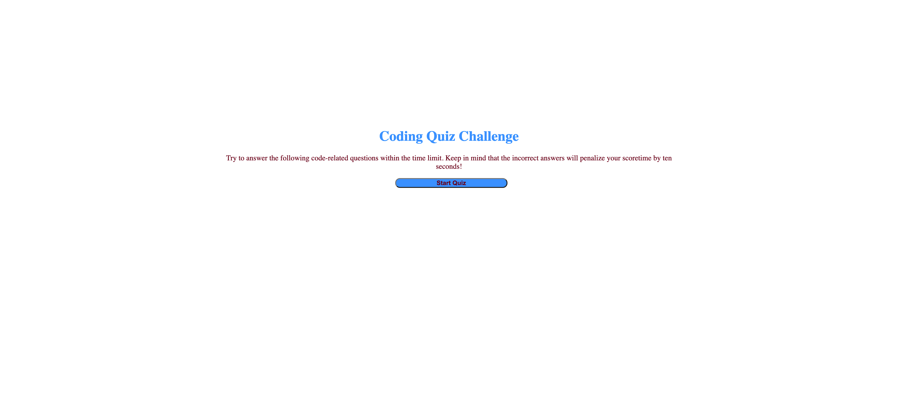
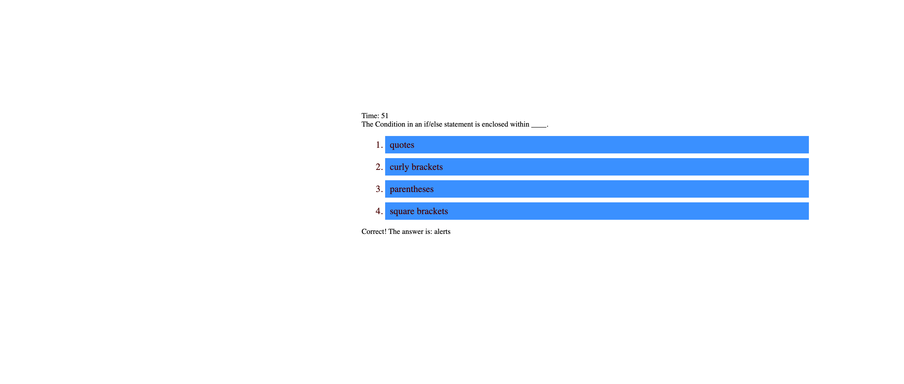
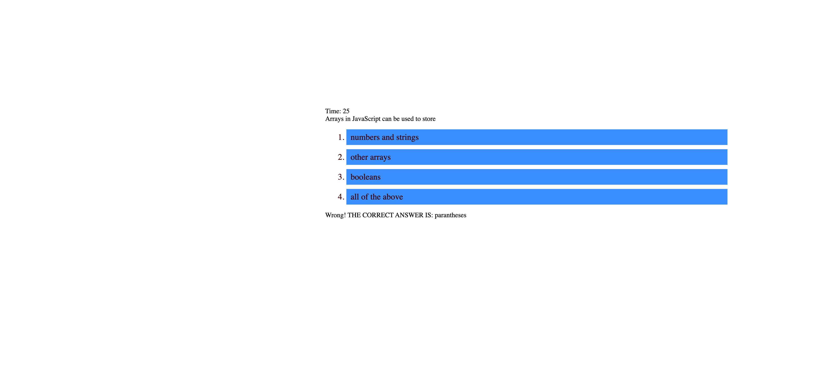
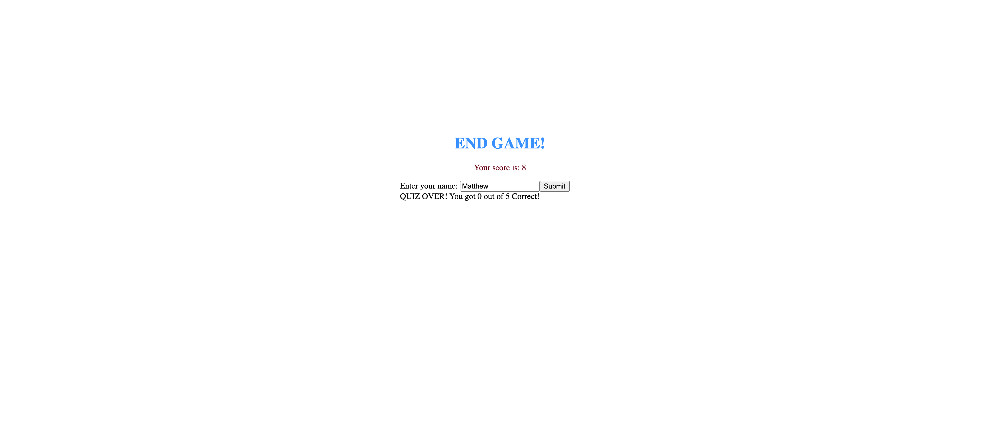

# Code-Quiz

## Description 

The goal of this project was to create a JavaScript code quiz that would test all of the subjects we had covered in the last week of class. It was meant to be challenging and combined many elements that were new and unfmailiar to us. The code quiz is a multiple choice style quiz that is timed and interactive, you can click on any of the list items to select your answer instead of a radio button. The app runs in the browser and the HTML and CSS is dynamically updated, powered by the JavaScript code I have written. Along with this it has a polished and responsive user interface.

## Installation 

To install this repo on your local drive you would have to clone the ssh key from my repo. Head into your local drive of choice in terminal or bash and do a git clone. Once you have done a git clone you are free to start working on this project. If you want to push your changes to my repo then you would have to head into terminal/bash and do a git add . Then a git commit -m explaning the changes made, and finally a git push to push the files onto the repo. 

## Finished project

My page is live on github!

 https://mattrward1030.github.io/Code-Quiz/

 ### Application as shown as it loads on the users screen

 

 ### Quiz first question loaded on user's screen

 

 ### Prompt shown when user gets answer correct 

 

### Prompt shown when user gets answer wrong 

 

 ### End of Quiz, enter name to save highscore

 

## Features
<ul>
<li> A JavaScript code quiz dynamically powered by JavaScript and Web API's.</li>
<li>The code quiz will run when the start button is clicked.</li>
<li>When the start button is clicked the start screen disappears and the questions along with the choices show up.</li>
<li> When the user answers a question by clicking on the answer then the user is presented with the next question. </li>
<li>A timer starting at 60 seconds appears, for every wrong answer a penalty of 10 seconds is assessed.</li>
<li>The quiz is finished when all questions are answered or the timer reaches zero</li>
<li>When the game is over the users score is the amount of time left on the timer</li>
<li>The user will be able to save their name and the score that they finished with</li>
<li>This application is comprised of three main files, an HTML, CSS, and JavaScript file.</li>
<li>The HTML file gives the page very minimal structure as most of the structure is dynamically presented in the JavaScript file.</li>
<li>The CSS file gives the page limited amounts of style as this is once again given primarily in the JavaScript file.</li>
<li>The JavaScript for this application is the real workhorse that powers this quiz. Everything from the timer starting and running down, to how it dynamically changes based off right and wrong answers is powered by JS. </li>
<li> There is many functions that make this page function, they start the ball rolling and make the start screen disappear and render the questions on the screen, and use a comparitive function to check if user selections are correct.</li>
<li> Local storage is used to store the high scores of the user so they can be pulled at any time and displayed to the user.</li>
</ul>

## Tests
N/A

## Credits
Shout-out to all the amazing instructors that helped me out along the way, my peers, and the wonderful staff at Ask BCS on our slack channel!

## Contributing

Pull requests are welcome and encouraged. Hit me up on my github <a href="https://github.com/mattrward1030">mattrward1030</a>

## Badges
 

## License

MIT License

Copyright (c) [2021] [Matthew Ward]

Permission is hereby granted, free of charge, to any person obtaining a copy
of this software and associated documentation files (the "Software"), to deal
in the Software without restriction, including without limitation the rights
to use, copy, modify, merge, publish, distribute, sublicense, and/or sell
copies of the Software, and to permit persons to whom the Software is
furnished to do so, subject to the following conditions:

The above copyright notice and this permission notice shall be included in all
copies or substantial portions of the Software.

THE SOFTWARE IS PROVIDED "AS IS", WITHOUT WARRANTY OF ANY KIND, EXPRESS OR
IMPLIED, INCLUDING BUT NOT LIMITED TO THE WARRANTIES OF MERCHANTABILITY,
FITNESS FOR A PARTICULAR PURPOSE AND NONINFRINGEMENT. IN NO EVENT SHALL THE
AUTHORS OR COPYRIGHT HOLDERS BE LIABLE FOR ANY CLAIM, DAMAGES OR OTHER
LIABILITY, WHETHER IN AN ACTION OF CONTRACT, TORT OR OTHERWISE, ARISING FROM,
OUT OF OR IN CONNECTION WITH THE SOFTWARE OR THE USE OR OTHER DEALINGS IN THE
SOFTWARE.
